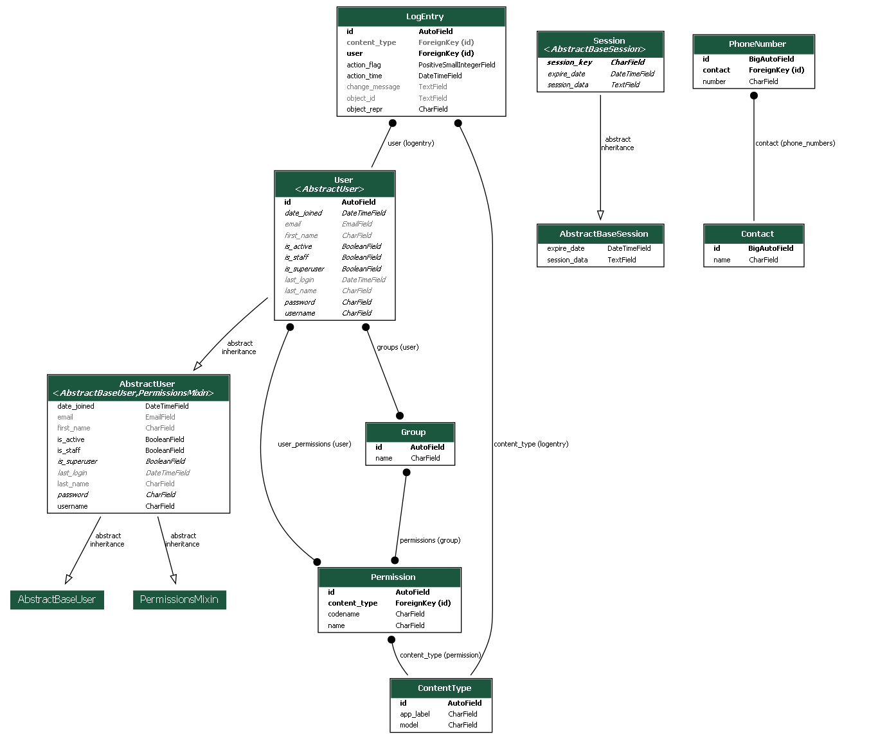

## How to run the application

* clone the application

* create a virtual environment to contain the project (for example: virtualenv venv)

* activate the virtual environment for windows: (source venv/Scripts/activate) for linux: (source venv/bin/activate)

* create .env file and add the SECRET_KEY as a environment variable

* install the requirements (pip install -r requirements.txt)

* create the database

    * python manage.py makemigrations
    * python manage.py migrate

* create the super user (Optional)

    * python manage.py createsuperuser
    * follow the instructions

* run the application
    * python manage.py runserver

## Dtabase Scheme Diagram
* you can view the database scheme diagram in the project called my_database_diagram.png

## Notes for navigation

* you can find the home page when accessing: http://localhost:8000/

* you can find the admin dashboard: http://localhost:8000/admin/
